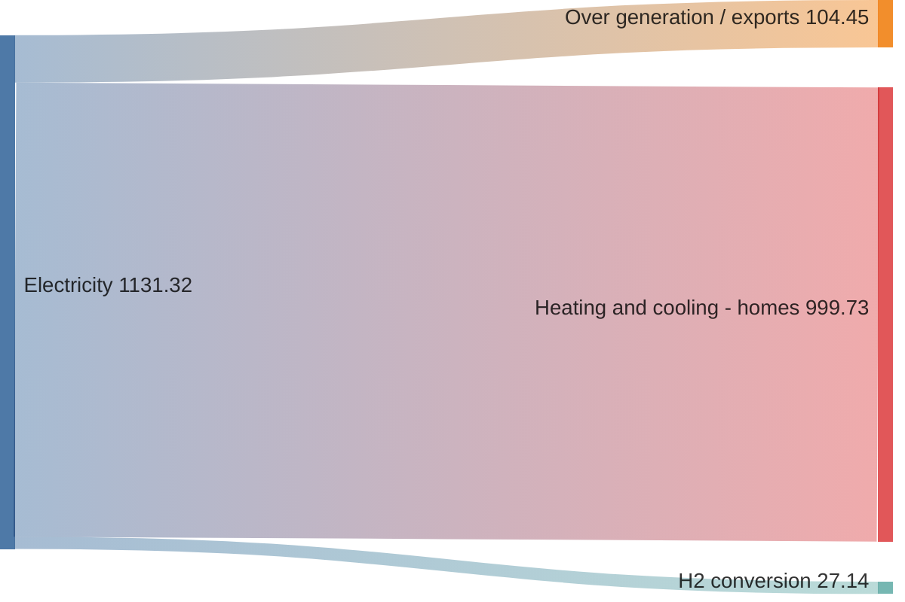

import { Tabs } from 'nextra/components'
 
<Tabs items={['UI', 'Code']}>
  <Tabs.Tab><div className="">
    <button className="d-btn">d-btn</button>
  </div></Tabs.Tab>
  <Tabs.Tab>
    ```html
    <button className="d-btn">d-btn</button>
    ```
  </Tabs.Tab>
</Tabs>



